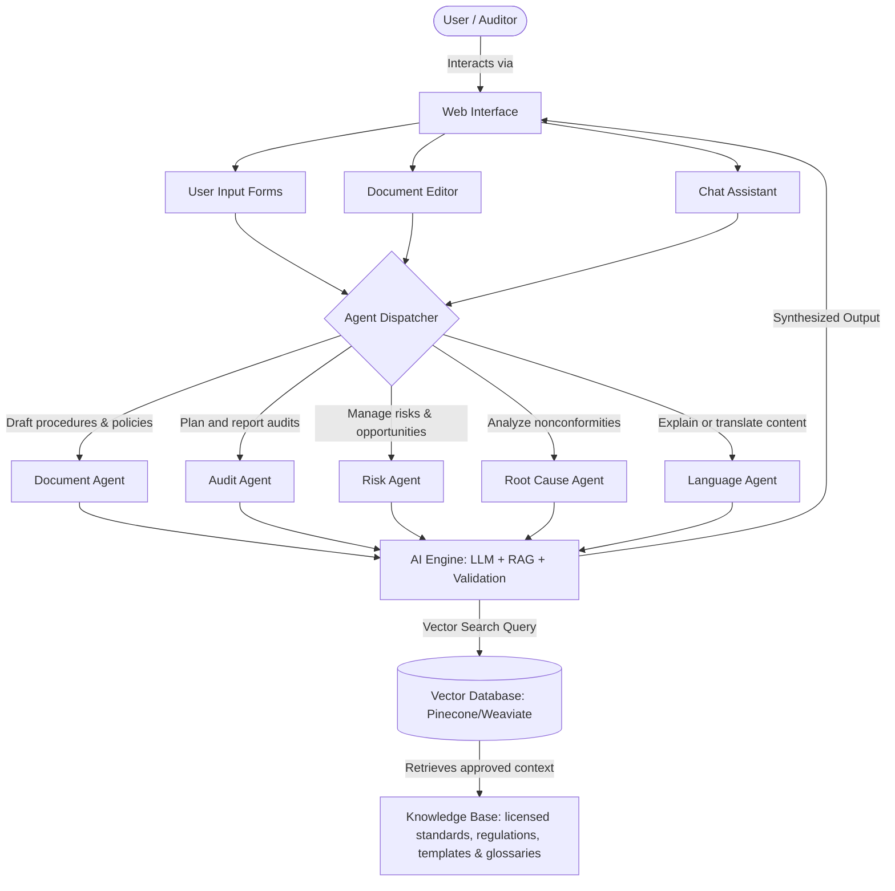

# Denhe reRuzivo AI
## Intelligent Quality Management Copilot

**Submission:** AI for Impact (AI4I) Challenge — Concept Stage  
**Organisation:** Quality Management Institute of Zimbabwe (QMIZ)  
**Status:** Documentation-only concept submission; no deployed application is included.

Denhe reRuzivo AI is a QMIZ concept-stage platform designed to make quality-management expertise more accessible to Zimbabwean organisations. It combines large language models (LLMs), retrieval-augmented generation (RAG), curated and licensed quality knowledge, and human review to support the management-system lifecycle.

The copilot is proposed to support the development of procedures, policies and manuals; ISO interpretation; risk and opportunity registers; audit planning and reporting; nonconformity and root-cause analysis; corrective actions; and approved quality-content translation into plain English, Shona and Ndebele.

## For evaluators

This repository is an evidence pack, not a runnable product. Start with the [submission record](SUBMISSION.md), then use the [evidence index](docs/evidence-index.md) to navigate the supporting documents.

## Submission documents

### Core documents
- [Technical proposal](proposal/fullsubmission.md)
- [Technical evidence index](docs/evidence-index.md)
- [System architecture](docs/architecture.md)
- [User journey map](docs/user-journey.md)
- [Security, privacy and responsible AI safeguards](docs/security-plan.md)
- [Data sources, rights, limitations and quality](docs/data-governance.md)

### Annexes
- [Annex A: Business Model and Sustainability Plan](annexes/annex-a-business-model.md)
- [Annex B: Deployment and Operational Plan](annexes/annex-b-deployment-plan.md)
- [Annex D: Technical Architecture Specifications](annexes/annex-d-technical-architecture.md)

## Proposed system workflow

The platform functions as a copilot for quality managers, auditors, laboratory personnel, consultants and operational teams. It reduces the cost and effort of implementing management systems while preserving professional accountability: all generated material remains a reviewable draft, not certification or legal advice.

### Proposed workflow

1. **User Request**: The user selects a task, standard, organisational context and preferred language—for example, a risk register, an audit checklist or a procedure draft.
2. **Agent Assignment**: The request is routed to the appropriate specialist workflow, such as document drafting, audit, risk, root-cause analysis or translation.
3. **Retrieval-Augmented Generation (RAG)**:
   * The AI Engine searches an authorised knowledge base for relevant standard excerpts, regulatory guidance, approved templates and organisational material the user is allowed to access.
   * Each response displays the source context and flags insufficient evidence rather than inventing a requirement.
4. **Context-Aware Synthesis**: The LLM produces a structured draft, explanation or translation that preserves technical meaning and separates recommendations from verified requirements.
5. **Human-in-the-Loop Review**: A qualified user validates, edits and approves the result before publication, implementation or use in an audit.
